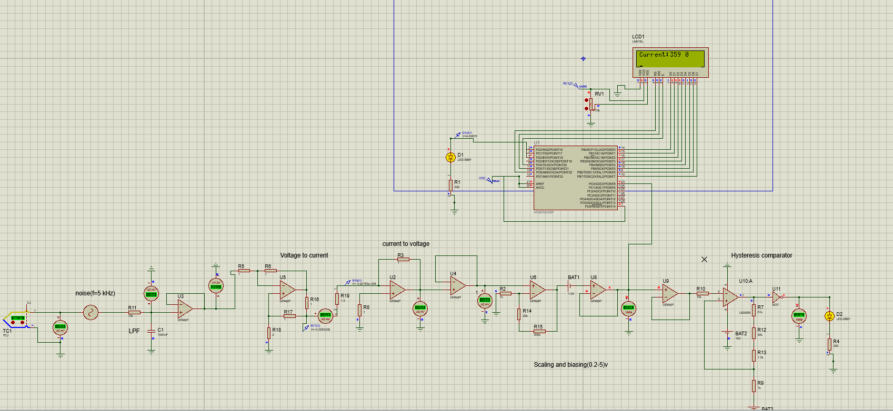

# Temperature Sensor (Thermocouple):
Using Proteus simulator, it is required to build a signal conditioning circuit that monitors oven temperature using a digital microcontroller. The microcontroller should take readings every second, it should display current temperature, average temperature at the last minute, an alarm if the signal exceeds the limits of 350 Celsius degrees. You should consider the following:
- The signal is carried to the control room using a long wire of 100 m.
- A noise signal of 60 KHz is applied directly to the sensor circuit.
- Oven temperature may vary between 100 and 350.
- It is required to have an additional non-digital alarm circuit that gives an alarm if temperature exceeds 350 degree or turned off when temperature goes below 340 degree.


## Complete Circuit Design:



## Components list

1. ATmega 328.
2. LCD (16x2).
3. LEDs
4. Operational Amplifier.
5. Thermocouple type J.
6. Resistors (10k,1 ,1.3 ,330 ,51k ,30k, 1.3k, 22k, 1k, 300k) in Ohms.
7. Capacitors (1uf).
8. Variable resistance .
9. Voltmeters &amp; Ameters.
10. Batteries.

## Thermocouple sensor


We chose the temperature sensor to be a thermocouple of J-Type to convert the temperature to voltage.

## Noise generation and rejection:


The noise is generated using a sine wave of 10 mv and frequency of 5 kHz since that the 60 kHz required causes long delays, this noise is rejected using a low pass filter of first order using passive components a resistor of 10K and a capacitor of 1 to have a cutoff frequency of 15 Hz, therefore any frequency above the cutoff frequency is attenuated and completely rejected


## Transmitting the signal:


We have 100m wire which will destroy the signal sent by the thermocouple due to the voltage drop on the resistance of the 100m wire, so we used a voltage to current converter then send the signal in the long wire as current then at the microcontroller we have current to voltage converter to get the signal as voltage again without any loses due to the long transmission line.
Now we will talk briefly about this two stages, firstly the voltage to current converter:
`I=-R_6 / (R_16 * R_5 )`
But to satisfy this relation we have a condition, where
`R_5 (R_16+R_17 )=R_18 R_6`

Secondly the current to voltage converter:
`V=-IR_3`

And this result is under the condition that  `R_3=R_8`

The following table shows the thermocouple readings and the corresponding current passing through the 100m wire and the corresponding voltage at the end of this two stages:

| temperature | Thermocouple readings | Current in the 100m wire | Output voltage of the two stages |
| --- | --- | --- | --- |
| 100 | 5.27 mv | 5.27 mA | 5.27 mv |
| 340 | 18.1 mv | 18.1 mA | 18.5 mv |
| 350 | 19.1 mv | 19.1 mA | 19.1 mv |

## Signal conditioning:


In this stage we will need to change our scale where (100\_ 350) is in the range of (5.27 - 19.1) mv so by scaling and biasing operations we will have the range of temperature as (0.4 - 4.86) v

And this is done as following:


`V_out  = A * V_in + V_B`

Where A is the slope of the straight line or we can say that it is the gain of the amplifying stage `V_B` and is the y-intercept or we can say it is the biasing battery.

By substituting we get the constants.

The following table shows the temperature readings of the thermocouple and the corresponding voltage of the thermocouple before signal conditioning and after:

| temperature | Thermocouple readings | Readings after signal conditioning |
| --- | --- | --- |
| 100 | 5.27 mv | 0.4 v |
| 340 | 18.1 mv | 4.68 v |
| 350 | 19.1 mv | 4.86 v |

## Non-digital alarm for specific temperatures:


In this circuit we used a Schmitt trigger circuit and inverter at its output, we need the alarm to turn on when the temperature is 350 and to turn off again when the temperature become below 340 it turns off again so we design the circuit as following:  


**Hint** : we used a supply voltage of
`V_CC= 15v &  -V_EE=0`

The output without the inverter will be until we reach the and 0 v when it is going below it until reaching the then it turns so we add an inverter at the output to get the required performance.

#### **Assumptions:**

- We use a 16 AWG (American Wire Gauge) The most common gauge chosen in control systems. It has a cross section area and total resistance for long by calculation. This type can carry 22 for chassis wiring and we work on maximum which is in the safe zone. It meets overcurrent problem.

# **Micro Controller:**

We use ATMEGA 328 micro controller.

## **Code:**

- ### **Directives**

```
#define F_CPU 1000000UL   //to tell the compiler how fast your micro controller is which is in the data sheet
#include <avr/io.h>
#include <util/delay.h>
#include <math.h>
#include <stdbool.h>	//to define the boolean data type

#define LCD_DATA PORTB    // define that port B is connected to data input of the LCD
#define en PIND4	      // define that Enable Pin is connected to PIN4 in PORTD  D4
#define rw PIND5          // define that read/write pin is connected to PIN4 in port D
#define rs PIND6          // define that Reset pin is connected to PIN6 in port D
```

We use `#define_F\_CPU_1000000UL` to tell util/delay.h how fast is our Microcontroller is. Some other Directives are used to allow constant values to be declared for use throughout our code such that PortB, Enable pin in the LCD, read/write pin and reset pin.


- ### **Functions Prototype**

```
/********************** LCD Functions Prototype ******************************/
void init_LCD(void);					//LCD initialization
void LCD_cmd(unsigned char cmd);		//Sending commands to LCD  
void LCD_write(unsigned char data);		//Writing an character on the LCD
void LCD_write_str(unsigned char *str);	//Writing an entire String on the LCD
void cursor_position(unsigned char x_pos , unsigned char y_pos); //Moving the cursor position
/****************************** ADC settings *****************************/
void init_ADC(void);					//ADC initialization
uint16_t ADC_Read(uint8_t channel);		//ADC reading form a specific channel(pin)
/***************************** Temperature Functions *******************/
void temp_avg(int *readings,  int *temp_sum); //Printing the temp avg on the LCD
```

We declare Functions prototype to tell the compiler that function exists and written at the end of the code.


- ### **Main**

Atmega328 has 3 main ports: Port B, Port D and Port C. We use Port B as an output for the LCD, Port D as an output for the LCD settings pins and alarm. Port C is an input for the incoming signal. Then we declare some variables that is used in the code. We call initialization functions for the LCD and ADC to prepare them to start. We send an command 0x0E to the LCD through LCD\_cmd() function to tell the LCD to make the display ON and the Cursor ON.

We start our repeated code that will run all the time. Firstly, we take the input signal to ADC to convert it to digital form. Then we convert it to a certain volt corresponding to that input from 0 to 5 Volts. Secondly, we take that volt and convert it to a specific temperature. Through a signal conditioning technique we convert the range (0-5) to (90 to 360) to display the right temperature.

To display the temperature obtained above, Firstly, We declare an array of characters to hold the number as string. Secondly, we display &quot;Current&quot; and the temp sent to `LCD_write_str()`. Finally, we display the seconds as an indicator because there is a delay in Proteus software because of analog simulation on 5 kHz. We know how much seconds spent during the simulation.

# Simulation:


Running the simulation for 60 seconds from 0 to 59 on 351 degree.

At the first minute, LCD will display the current temperature and the seconds. When seconds becomes 59, LCD will display the average of the last minute in the second line of the LCD. Then the seconds will start over from 0 which indicates the first second of the following minute. Then every second, LCD will display the average of the last 60 seconds.

## **FULL CODE** :

```
/*
 * GccApplication1.c
 *
 * Created: 5/12/2020 7:41:17 PM
 * Author : ZAMALA
 */
#define F_CPU 1000000UL   //to tell the compiler how fast your micro controller is which is in the data sheet
#include <avr/io.h>
#include <util/delay.h>
#include <math.h>
#include <stdbool.h>	//to define the boolean data type

#define LCD_DATA PORTB    // define that port B is connected to data input of the LCD
#define en PIND4	      // define that Enable Pin is connected to PIN4 in PORTD  D4
#define rw PIND5          // define that read/write pin is connected to PIN4 in port D
#define rs PIND6          // define that Reset pin is connected to PIN6 in port D

/********************** LCD Functions Prototype ******************************/
void init_LCD(void);					//LCD initialization
void LCD_cmd(unsigned char cmd);		//Sending commands to LCD  
void LCD_write(unsigned char data);		//Writing an character on the LCD
void LCD_write_str(unsigned char *str);	//Writing an entire String on the LCD
void cursor_position(unsigned char x_pos , unsigned char y_pos); //Moving the cursor position
/****************************** ADC settings *****************************/
void init_ADC(void);					//ADC initialization
uint16_t ADC_Read(uint8_t channel);		//ADC reading form a specific channel(pin)
/***************************** Temperature Functions *******************/
void temp_avg(int *readings,  int *temp_sum); //Printing the temp avg on the LCD


int main(void)
{
	DDRB = 0xFF; // Port B set as output
	DDRD = 0xFF; // port D set as output
	DDRC = 0X00;  // PORT C set as input

	float data_read;
	double temp_volt;
	int temp_sum = 0 ;
	int temp;
	int readings[60]={0};
	int seconds = 0;
	bool flag = false;

	init_LCD();   // initialize LCD
	init_ADC();   // initialize ADC
	_delay_ms(100);

	LCD_cmd(0x0E);  // Display ON , Cursor ON
	_delay_ms(100);


    while (1)
    {		
		char num[8] ={0};
		// taking reading from Pin 0 through the ADC.
		data_read = ADC_Read(0);   //this var should take a value from 0 to 1023 (10 bit ADC).
		temp_volt = data_read*5/1023;  // this value is a voltage in range (0-5) corresponding to a certain temp
		temp = temp_volt * (27000/481) + (37080/481)+1;
		// alarm detection
		if( temp >= 350)
		{
			PORTD |= (1<<PIND2); //Put 1 on the output pin: Port D pin 2
		}
		else
		{
			PORTD &= ~(1 <<PIND2);//Put 0 on the output pin: Port D pin 2
		}
		if( seconds ==0){
			temp++;
		}
		/* first line in the LCD */

		LCD_write_str("Current:");  // data sent converted to ascii code  total delay= 102ms * num of character
		itoa(temp, num , 10) ;      // convert the temp to an array of characters
		LCD_write_str(num);		//print the string on the LCD
		LCD_write(' ');		
		itoa(seconds, num , 10) ;
		LCD_write_str(num);			//Printing seconds indicator

		// move to the second line
		cursor_position(0,1);
		if(seconds == 59)
		{
			// calculate the avg and print it
			readings[seconds]= temp ;
			seconds = 0;
			flag = true;
			temp_avg(readings, &temp_sum);
		}
		else if (flag)
		{
			readings[seconds]= temp;
			seconds++;
			temp_avg(readings, &temp_sum);
		}
		else if (flag == false)
		{
			readings[seconds]= temp;
			seconds++;
		}
		temp_sum = 0;
		LCD_cmd(0x0E);  // Display ON
		_delay_ms(1000);
		LCD_cmd(0x01); // LCD clear

    }
}
/*******************************Functions**********************************/
void init_LCD()
{
	//Any address need to be sent to LCD must go through 3 steps
	/*
      1.Reset
	  2.Write
	  3. reactive the ENABLE  high then low

	  these 3 steps will be written in LCD_cmd Function.
	*/
	_delay_ms(30);  // 30ms before doing anything

	LCD_cmd(0x38);    // 0X38 is the address required to initialize the LCD in 8bit mode
	_delay_ms(1);
	LCD_cmd(0x01);   //0x01 is the address to clear the screen
	_delay_ms(1);
	LCD_cmd(0x02);   //Return HOME
	_delay_ms(1);
	LCD_cmd(0x06);   //this address make the LCD increment in cursor
	_delay_ms(1);
	LCD_cmd(0x80);     // Go to the first position at the first line
	_delay_ms(1);
}


void LCD_cmd(unsigned char cmd)
{
	/*This Function do 3 steps mentioned above */
	LCD_DATA = cmd ; //put the address cmd on PORTB which is LCD_DATA
	// 1. Reset = 0
	PORTD &= ~(1 << rs);
	// 2. write = 0
	PORTD &= ~(1<< rw);
	// 2.Enable = high
	PORTD |= (1 << en);
	_delay_ms(2);
	// Then LOW
	PORTD &= ~(1 << en);
}

void LCD_write(unsigned char data)
{
	/*
	to make the LCD know if the sent data is DATA NOT address
	we put reset = 0  if we send address
	we put reset = 1   if we send DATA

	and it is same as LCD_cmd but the difference is Reset
	*/
	LCD_DATA = data ; //put the address cmd on PORTB which is LCD_DATA
	// 1. Reset = 1
	PORTD |= (1 << rs);
	// 2. write = 0
	PORTD &= ~(1<< rw);
	// 2.Enable = high
	PORTD |= (1 << en);
	_delay_ms(2);
	// Then LOW
	PORTD &= ~(1 << en);
}


void LCD_write_str(unsigned char *str)
{
	int i;
	for(i=0;str[i]!=0;i++)  /* send each char of string till the NULL */
	{
		LCD_write(str[i]);  /* call LCD data write */
	}

}

void cursor_position(unsigned char x_pos , unsigned char y_pos)
{
	/*
	x_pos for x_axis 0->16
	y_pos for y_axis 0-1
	*/
	// line 1 : col1-> 0x80 , col2-> 0x81 ,..etc
	// line 2 : col1 -> 0xc0, col2-> 0xc1 ...etc
	uint8_t address =  0 ;
	if (y_pos == 0)
	{
		address =  0x80;
	}
	else if( y_pos == 1)
	{
		address = 0xC0;
	}
	if(x_pos < 16)
	{
		address += x_pos ;
	}
	LCD_cmd(address);
}

void init_ADC(void){
	ADMUX |= (1<<REFS0);    //setting voltage ref = Vcc
	ADCSRA |= (1<<ADEN);    // Turn ADC ON
	ADCSRA |= (1<<ADSC) ;
	ADCSRA |= (1<<ADPS2) |(1<<ADPS1)|(1<<ADPS0);
}

uint16_t ADC_Read(uint8_t channel){
	ADMUX &= 0xF0;     // clear the older channel before any new conversion
	ADMUX |= channel    ;     // defines the new ADC channel for the new reading
	ADCSRA |= (1<<ADSC);    // ADC must be Enabled  for every single conversion  (start new conversion)
	while(ADCSRA & (1<<ADSC));  //WAIt until conversion is done
	return ADC;
}

void temp_avg(int *readings, int *temp_sum)
{
	int temp_avg = 0;
	char num2[8] = {0};  //An array to hold the characters of the num
	for (uint8_t i= 0 ; i <= 59 ;i++)
	{
		*temp_sum += readings[i];
	}
	temp_avg = *temp_sum / 60;
	//Printing the avg
	LCD_write_str("Temp_avg:");
	itoa((int)temp_avg, num2 , 10);
	LCD_write_str(num2);

}
```
